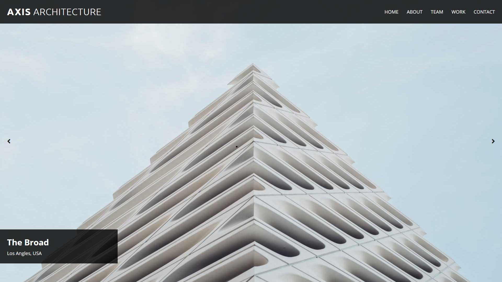

# Axis Architecture
A website for an architectural firm using form elements in HTML and JavaScript to create an image slider.

## Screenshot

## Visit
Click [here](https://yuj94.github.io/company-home-page/) to visit the website.

## Technologies
Project was built with:
- HTML
- CSS
- JavaScript
- GitHub

## Status
Project is completed.